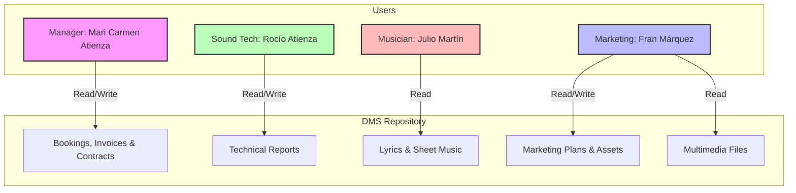

---

# Callearte: Enterprise Information Systems & Digital Transformation

This repository contains the complete systems architecture and requirements specification for **Callearte**, a professional flamenco musical organization. This project documents the digital transformation from a decentralized, manual workflow to an integrated **Content Management System (CMS)** and **Document Management System (DMS)**.

## 📖 Business Context

Callearte is a 15-employee organization consisting of marketing staff, musicians, and technical personnel based in El Puerto de Santa María.

### Current State vs. Objectives

* 
**Current State:** The organization lacks integrated management systems, relying on email for bookings, WhatsApp for coordination, and individual hard drives for storage, leading to data duplication and potential loss.

* **Primary Objectives:**
* 
**OBJ-0001 (Document Management):** Organize and manage documents according to business needs.

* 
**OBJ-0003 (Security & Control):** Protect confidential information through access permissions, encryption, and automatic backups.

* **Promotion & Visibility:** Facilitate live bookings and increase visibility through concert schedules and multimedia publication.

---

## 🛠️ Requirements Catalog

### 1. Information Requirements (Data Entities)

The system is architected to manage the following data structures:

| ID | Entity | Specific Data to Store |
| --- | --- | --- |
| **IRQ-0001** | **Bookings** | Client name, email, event date, address, and booking date.

 |
| **IRQ-0002** | **Invoices** | Service required, duration, amount, emission date, and status.

 |
| **IRQ-0003** | **Sheet Music** | Author, creation date, and song name.

 |
| **IRQ-0004** | **Contracts** | Name of the contracted party, type, and expiration date.

 |
| **IRQ-0005** | **Lyrics** | Song names for rehearsal and memorization.

 |
| **IRQ-0006** | **Tech Reports** | Material code, last review date, and equipment status.

 |
| **IRQ-0007** | **Multimedia** | Event files, event date, file type, and event name.

 |
| **IRQ-0008** | **Marketing** | Marketing plans, file versions, and promotional asset types.

 |

---

## 🔄 System Interaction & Roles

The following diagram illustrates how different user roles interact with the repository based on the established business rules and permissions.

---

## 💼 Business Rules (Logic Layer)

Access and operations are strictly governed by the following roles:

| ID | Rule Name | Logic & Permissions |
| --- | --- | --- |
| **CRQ-0004** | **Manager Access** | The manager has Read/Write permissions for Bookings, Invoices, and Contracts.

 |
| **CRQ-0005** | **Musician Access** | Musicians and singers have Read-only access to lyrics and sheet music.

 |
| **CRQ-0006** | **Tech Access** | The sound technician has Read/Write permissions for technical reports.

 |
| **CRQ-0007** | **Marketing Access** | Read/Write access for marketing docs; Read-only access for multimedia.

 |

---

## 📂 Project Structure

* **/Analysis**: UML modeling and system requirements documentation.
* **/CMS**: Content Management System core logic and requirement mapping.
* 
**/DMS**: Document Management System specifications for file handling.

* **/WSCT**: Web Service and Commerce Tool integration for booking automation.

---
