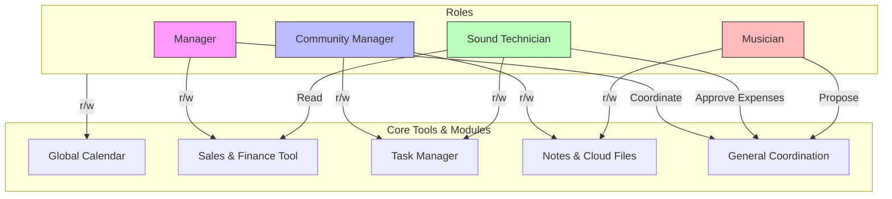

---

# Callearte ISN: Internal Social Network & Operational Hub

This repository contains the system requirements and business case for the **Callearte Internal Social Network (ISN)**. The project aims to centralize the band's communication, creative processes, and internal operations into a private digital ecosystem to reduce friction and preserve technical and creative knowledge.

## 🎯 Vision & Mission

* 
**Mission:** To centralize internal operations through a private social network that improves coordination and preserves creative assets.

* 
**Vision:** To become the "operational brain" of the band, integrating composition, production, marketing, and management in a scalable space.

## 📊 Business Analysis (SWOT)

The following analysis outlines the current state of the organization prior to the ISN implementation:

| Strengths | Weaknesses |
| --- | --- |
|  **Creative Talent:** Constant flow of ideas and execution capacity.

 |  **Info Dispersion:** Use of multiple non-integrated apps.

 |
|  **Commitment:** High team involvement and willingness to collaborate.

 |  **Versioning Issues:** Risk of loss or duplication of materials.

 |
|  **Multidisciplinary:** Integrated marketing, technical, and composition teams.

 |  **Key-person Dependency:** Knowledge is not systematized.

 |

| Opportunities | Threats |
| --- | --- |
|  **Digitalization:** Professionalizing processes with proprietary tools.

 |  **Market Saturation:** External channels competing for audience attention.

 |
|  **External Collabs:** Integrating producers and guests via role-based access.

 |  **Security Risks:** Content leaks prior to official releases.

 |
|  **Audience Data:** Optimizing strategies through integrated metrics.

 |  **Adoption Curve:** Time required for configuration and training.

 |

---

## 🚀 Pilot Project (Phase 1)

The project starts with an 8-12 week pilot to validate coordination efficiency and incident reduction.

### Expected ROI (Return on Investment)

* 
**Time Savings:** 20-30% reduction in rehearsal coordination and logistics time.

* 
**Technical Reliability:** 30-50% reduction in technical incidents through checklists and maintenance plans.

* 
**Creative Output:** 15-25% increase in ideas converted into rehearsal-ready pieces.

* 
**Marketing Impact:** 10-20% increase in campaign consistency.

---

## 🛠️ System Architecture & Interaction

This diagram illustrates how different roles interact with the platform's core modules and tools based on the defined business rules.

---

## 📝 Functional Requirements (FRQ)

The system integrates several specialized tools to handle daily operations:

* 
**FRQ-0002 (Calendar):** A global tool for all groups to track events and tasks.

* 
**FRQ-0003 (Cloud Storage):** Dedicated space for the Editing and Rehearsal groups to access files from any device.

* 
**FRQ-0004 (Notes):** Conclusion logs for rehearsals and performance feedback.

* 
**FRQ-0001 (Sales/Finance):** Revenue and expense tracking for the Financial Management group.

* 
**FRQ-0006 (Multimedia Pipeline):** A kanban-style tool to move assets through "Ideas," "Production," "Review," and "Ready to Publish" .

* 
**FRQ-0008 (Expense Registry):** Workflow where members request funds, and the Manager approves via an "Approved" column .

---

## 🔐 Access Control & Business Rules (CRQ)

Permissions are strictly defined to ensure security and operational order:

| Role | Core Permissions | Group Access |
| --- | --- | --- |
| **Manager** | Modify Sales (r/w), use Calendar (r/w).

 | Read/Write in all groups; Coord. in General.

 |
| **CM** | Use Tasks (r/w), Cloud Files (r/w), Calendar (r/w).

 | Read/Write in all groups; Proposals in General.

 |
| **Sound Tech** | Read Sales (r), use Calendar & Tasks (r/w).

 | Read/Write in all groups; Approve expenses in General.

 |
| **Musician** | Use Notes & Multimedia (r/w), Calendar (r/w).

 | Read/Write in all groups; Proposals in General.

 |

---

## 👥 Project Participants

* 
**Callearte (Client):** Mari Carmen Atienza (Manager), Rocío Atienza (Sound Tech), Julio Martín (Musician), Fran Márquez (Marketing) .

* 
**GSI Group (Development):** Ricardo Fernández, Marco Granja, Sergio Díaz, Moisés Guillermo Godoy .

---
